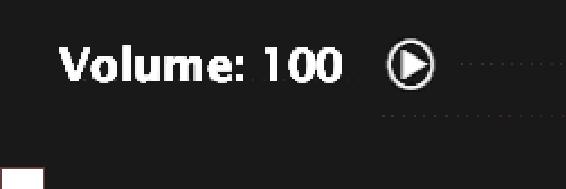
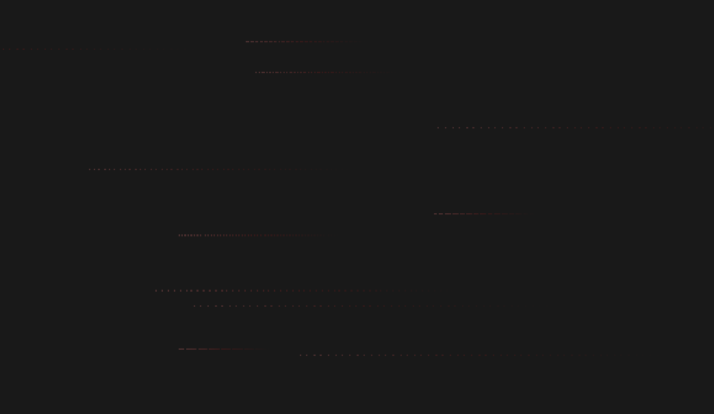

# Music Visualiser Project

## About
1. MVP Song: Enemy by Imagine Dragons and JID
2. Master Replit: https://github.com/Kylreia/MusicVisualiserProject

3. DEMO of Project: 

[](https://www.youtube.com/watch?v=J2kHSSFA4NU)

## Team Members and areas of this project we're proud of

| Name| Student ID |
|-----------|-----------|
|Junhan Dang | D18123630 |
|Keith Railey Rumbaua | C20463336 |
|Lovely Fernandez | C20305696 |
|Paris Le | C20401536 |

### Junhan Dang | D18123630

"Lorem Ipsum is simply dummy text of the printing and typesetting industry. Lorem Ipsum has been the industry's standard dummy text ever since the 1500s, when an unknown printer took a galley of type and scrambled it to make a type specimen book. It has survived not only five centuries, but also the leap into electronic typesetting, remaining essentially unchanged. It was popularised in the 1960s with the release of Letraset sheets containing Lorem Ipsum passages, and more recently with desktop publishing software like Aldus PageMaker including versions of Lorem Ipsum."

### Keith Railey Rumbaua | C20463336

"Lorem Ipsum is simply dummy text of the printing and typesetting industry. Lorem Ipsum has been the industry's standard dummy text ever since the 1500s, when an unknown printer took a galley of type and scrambled it to make a type specimen book. It has survived not only five centuries, but also the leap into electronic typesetting, remaining essentially unchanged. It was popularised in the 1960s with the release of Letraset sheets containing Lorem Ipsum passages, and more recently with desktop publishing software like Aldus PageMaker including versions of Lorem Ipsum."

### Lovely Fernandez | C20305696

"The entire project is great but I am most proud of the collaboration and teamwork I had with my team. Everyone was helpful and provided their own individual creativity into our music visualiser. I was responsible for the key binds; volumes, pause/play and lastly, keeping track of the song timeline. The hardest part of my contribution was the timeline feature. To achieve this, I first used the length() method to get the length of the current song in milliseconds. I then used the position() method to determine where in the track the user is, also in milliseconds. Using a mathematical formula, I was able to convert the current position into a percentage of the track. I then used this percentage as the x2 variable in the rect() function of processing, to draw a rectangle that will constantly update depending on where in the song the user is."

### Paris Le | C20401536
"Lorem Ipsum is simply dummy text of the printing and typesetting industry. Lorem Ipsum has been the industry's standard dummy text ever since the 1500s, when an unknown printer took a galley of type and scrambled it to make a type specimen book. It has survived not only five centuries, but also the leap into electronic typesetting, remaining essentially unchanged. It was popularised in the 1960s with the release of Letraset sheets containing Lorem Ipsum passages, and more recently with desktop publishing software like Aldus PageMaker including versions of Lorem Ipsum."


# Description of the assignment
Our team has chosen "Enemy by Imagine Dragons and JID" for our Music Visualiser Project. 
In order to achieve a neater and organised display - we will separate the background instrumental and voicetrack of the song into three different visualisers by using the different levels of frequencies of each element as well as using the user's default screen size as the full display of the application. 
Art assets and the colour palette used are in relation to the song in itself. It is a song based on a TV series - Arcane - inspired from a well known e-Sport game by Riot, League of Legends. 

Other elements added into the application are;
- Volume (Up and Down arrow keys)
- Pause/Play Buttom (Spacebar key)
- Bar Timeline in which lets the user know the length of the song and what part of the song they are in.
- Star Visual Background (An animated background)


# Instructions 

1. Open application (f5)
2. Press SPACE key to play or pause the song.
3. Use your Top and Bottm arrow keys to change the volume. 
4. Restart the song at anytime by pressing R key. 


# How it works

Master Replit: https://github.com/Kylreia/MusicVisualiserProject/tree/master/java/src

## Code Below for Volume, Pause and Play functions 


### Key Binds
```JAVA 
    //Play Controls
    public void keyPressed()
    {
    	//Setting SPACE as a pause and play button
        if (key == ' ')
        {
            if (!song.isPlaying()) 
            {
                song.play();
            }
            else {
                song.pause();
            }

            smooth();
        }

        //Setting R as a restart button
        if (key == 'r' || key == 'R')
        {
            song.cue(0);
        }
        
        //Setting Up and Down arrow keys as the volume buttons
        if (keyCode == UP && volume < 0) 
        {
            volume++;

        }

        if (keyCode == DOWN) 
        {
            volume--;
        }
    }
```

### Location and Position of img assets for Pause and Play
```JAVA
	public void icons() 
    {
        if (song.isPlaying())
        {
            image(pauseIcon, width * 0.09f, height * 0.95f - 20);
        }
        else {
            image(playIcon, width * 0.09f, height * 0.95f - 20);
        }
    }
```

### Timeline of the Song and Draw the line
```JAVA
	public void timeline()
    {
        float maxLen = song.length();
        float currentPer = floor((song.position() / maxLen) * 100);
        if (currentPer == 0) currentPer = 1;
        rect(0, height-10, (currentPer / 100) * 1920, height-40);         
    }
```

### Volume Text
```JAVA
   public void volume() 
    {
        song.setGain(volume);
        fill(255);
        textSize(20);
        text("Volume: " + (floor(song.getGain()) + 100), width * 0.015f, height * 0.95f);
    }
```
## Code Below for Draw() and Visualiser


### Draw the Stars
```JAVA
   public void draw()
    {
        for(int i = 0; i < 100; i++)
        {
            point(x[i], y[i]);
            x[i] = x[i] - speed[i];

            if(x[i] < 0)
            {
                x[i] = width;
            }
        }
    }    

```

### Draw the visualizer rings
```JAVA
    public void draw()
    {
        fill(0, 5);
        rect(0, 0, width, height);
        pushMatrix();
        translate(width / 2, height / 2);
        rotate(radians(frameCount % 360 * 2));

        for(int j = 0; j < 360; j++)
        {
      
            if(song.mix.get(j) * 200 > 50)
            {
                stroke(color3, 100, 100);
            }
            else 
            {
            stroke(color4, 100, 100);
            }
            line(cos(j) * 25, sin(j) * 25, cos(j) * abs(song.left.get(j)) * 50 + cos(j) * 25, sin(j) * abs(song.right.get(j)) * 50 + sin(j) * 25);
        }

        for(int k = 360; k > 0; k--)
        {
      
            if(song.mix.get(k) * 200 > 25)
            {
                stroke(color1, 100, 100);
            }
            else
            {
                stroke(color2, 100, 100);
            }
            line(cos(k) * 100, sin(k) * 100, cos(k) * abs(song.right.get(k)) * 75 + cos(k) * 100, sin(k) * abs(song.left.get(k)) * 75 + sin(k) * 100);   
        }

        for(int l = 0; l < 360; l++)
        {
      
            if(song.mix.get(l) * 200 > 25)
            {
                stroke(color3, 100, 100);
            }
            else
            {
                stroke(color4, 100, 100);
            }
            line(cos(l) * 175, sin(l) * 175, cos(l) * abs(song.right.get(l)) * 100 + cos(l) * 175, sin(l) * abs(song.left.get(l)) * 100 + sin(l) * 175);   
        }
  
        popMatrix();
        volume();
        icons();
        timeline();
    }    
```

# Others: Structuring GitHub Read.me
## Markdown Tutorial

This is *emphasis*

This is a bulleted list

- Item
- Item

This is a numbered list

1. Item
1. Item

This is a [hyperlink](http://bryanduggan.org)

# Headings
## Headings
#### Headings
##### Headings

This is code:

```Java
public void render()
{
	ui.noFill();
	ui.stroke(255);
	ui.rect(x, y, width, height);
	ui.textAlign(PApplet.CENTER, PApplet.CENTER);
	ui.text(text, x + width * 0.5f, y + height * 0.5f);
}
```

So is this without specifying the language:

```
public void render()
{
	ui.noFill();
	ui.stroke(255);
	ui.rect(x, y, width, height);
	ui.textAlign(PApplet.CENTER, PApplet.CENTER);
	ui.text(text, x + width * 0.5f, y + height * 0.5f);
}
```

This is an image using a relative URL:


This is an image using an absolute URL:


This is a youtube video:

[](https://www.youtube.com/watch?v=J2kHSSFA4NU)

This is a table:

| Heading 1 | Heading 2 |
|-----------|-----------|
|Some stuff | Some more stuff in this column |
|Some stuff | Some more stuff in this column |
|Some stuff | Some more stuff in this column |
|Some stuff | Some more stuff in this column |

## Instructions
- Fork this repository and use it a starter project for your assignment
- Create a new package named your student number and put all your code in this package.
- You should start by creating a subclass of ie.tudublin.Visual
- There is an example visualiser called MyVisual in the example package
- Check out the WaveForm and AudioBandsVisual for examples of how to call the Processing functions from other classes that are not subclasses of PApplet

